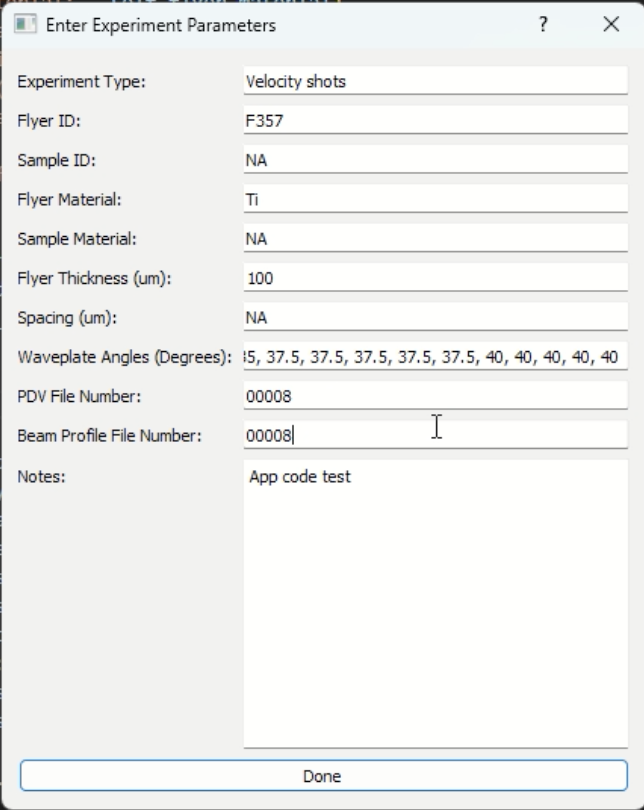
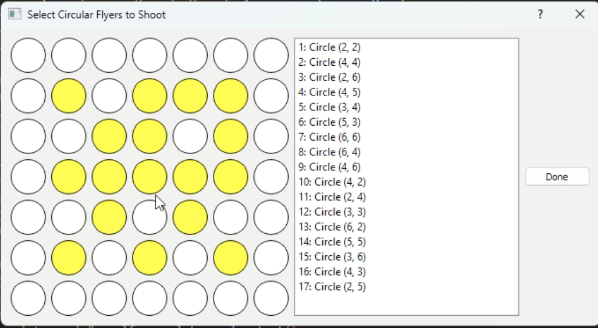
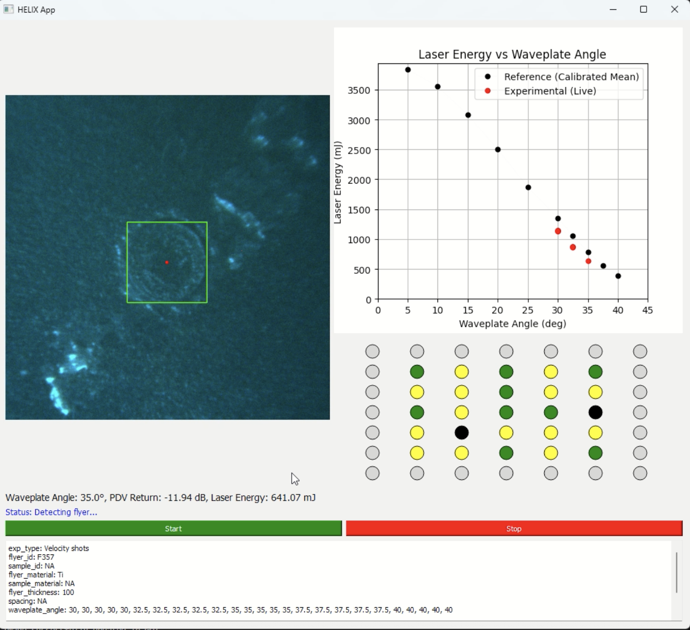

# HELIX Automation App

**A Modular Python Application for High-Throughput Laser-Driven Impact Experiments**  
Real-time vision • Closed-loop control • Hardware-integrated automation

**Author:** Anuruddha Bhattacharjee  
**GitHub:** [@Anuruddha22](https://github.com/Anuruddha22)  
**Institution:** Johns Hopkins University  
**Year:** 2025 

## Overview

The HELIX Automation App is a modular, Python-based control platform developed to automate and integrate the instruments used in the HELIX system (High-throughput Extreme Laser-driven Impact eXperiments). It combines real-time vision-based micro-flyer detection, precise motion control, laser triggering, and sensor feedback in a unified, user-friendly GUI. The system enables closed-loop operation with on-the-fly parameter tuning for high-throughput, reproducible experimentation.

---

## Key Features

- **Vision-guided micro-flyer alignment** via a CNN-based detection model  
- **Automated 2D motion stage control** for precision targeting  
- **Synchronized laser pulse triggering** using a delay generator  
- **Real-time data logging** from PDV and power meter sensors  
- **Live camera feedback** for visual verification and positioning  
- **Step-by-step GUI interface** for intuitive experiment control   

---

## Project Structure

| File/Folder         | Description |
|---------------------|-------------|
| `helix_controller.py` | Core automation class that integrates all hardware modules and coordinates the main experimental automation loop |
| `helix_app.py`        | PyQt5-based graphical user interface for interactive experiment control |
| `cnn_model.py`        | Implements CNN-based flyer detection using pre-trained PyTorch models |
| `delay_generator.py`  | Interface for controlling the delay generator to trigger laser pulses |
| `motion_stage.py`     | Wrapper forcontrolling the ACS motion stage |
| `power_meter.py`      | Wrapper for reading laser pulse energy using a Gentec-EO power meter |
| `pdv.py`              | Interfaces with the Photonic Doppler Velocimetry (PDV) system for reading and writing raw PDV metadata related to micro-flyer impact |
| `top_camera.py`       | Captures and processes frames from the IDS uEye+ camera for vision-based flyer detection and alignment |
| `waveplate_rotator.py`| Controls an optical waveplate to adjust polarization or laser drive energy |
| `beam_profiler.py`    | Interfaces with the Beamage SDK to extract laser beam profile data via DLL |
| `support_files/`      | Contains pre-trained CNN models, calibration Excel files, required DLLs, and SDK installers |
| `Images/`             | Sample image frames used for flyer detection testing and visualization |
| `requirements.txt`    | List of required Python packages and dependencies |

---

## Installation

> Tested on **Windows 11 Pro** with required SDKs for camera, motion stage, and beam profiler.  
> Support for **Linux systems** is in development and currently undergoing testing.

1. **Clone the repository**:
```bash
git clone https://github.com/Anuruddha22/Helix-Automation-App.git
cd Helix-Automation-App
```

2. **Set up a Python virtual environment**:
```bash
python -m venv helix-env
helix-env\Scripts\activate    # For Windows
# or
source helix-env/bin/activate  # For macOS/Linux
```

3. **Install dependencies**:
```bash
pip install -r requirements.txt
```

4. **Install third-party SDKs manually**:
   - IDS peak SDK (for camera)
   - Thorlabs/ACS Motion Control SDK
   - Beamage SDK (already included in `support_files/`)

---

## Running the App

To launch the HELIX Automation GUI, run:

```bash
python helix_app.py
```

> Before launching, make sure:
> - A sample is properly loaded and aligned in the field of view  
> - All hardware components (camera, motion stage, delay generator, power meter, PDV, etc.) are connected and powered on
> - Required SDKs are installed and available on the system path 
> - SDK paths or device-specific configurations are correctly set in `helix_app.py` or `helix_controller.py` if required

---

### Experimental Workflow

1. Set experimental parameters (e.g., Flyer ID, Flyer material, Waveplate angles).  



2. Select target flyer locations using the GUI grid interface.  



3. Verify the live camera feed to ensure proper field of view and flyer visibility.  



4. Start the experiment by clicking the `Start` button in the GUI.  
5. Camera detects the user-selected micro-flyer using a trained CNN model.   
6. Motion stage aligns the flyer with the laser beam path.  
7. PDV system measures return signal to assess flyer readiness.  
8. Laser is triggered by the delay generator if PDV signal is within acceptable limits; otherwise, the flyer is skipped.  
9. All relevant data are logged, including images, energy, PDV velocity, and timing metadata.   
10. System advances to the next flyer and repeats the process automatically.
11. Monitor the live status and stop the experiment manually using the `Stop` button in the GUI (e.g., emergency stop or upon completion).   

---

## Output

- Excel logs for each laser shot, including time, flyer position, PDV data, laser energy, and system parameters.   

---

## Contributing

Contributions are welcome! Please feel free to submit a Pull Request. For major changes, please open an issue first to discuss what you would like to change.

## License

This project is licensed under the MIT License - see the [LICENSE](LICENSE) file for details.

---

## Acknowledgments

Collaborators from the Ramesh research group and HEMI at Johns Hopkins University. This system is part of a larger effort to automate high-throughput material testing using robotic automation and AI.

---

## Citation

If you use HELIX Automation App in your work, please cite:

```bibtex
@software{bhattacharjee2025helixapp,
  title     = {HELIX Automation App: A Modular Python Application and Control Platform for Automated High-Throughput Laser-Driven Impact Experiments},
  author    = {Bhattacharjee, Anuruddha},
  year      = {2025},
  url       = {https://github.com/Anuruddha22/Helix-Automation-App},
  note      = {Version 1.0}
}
```
---
